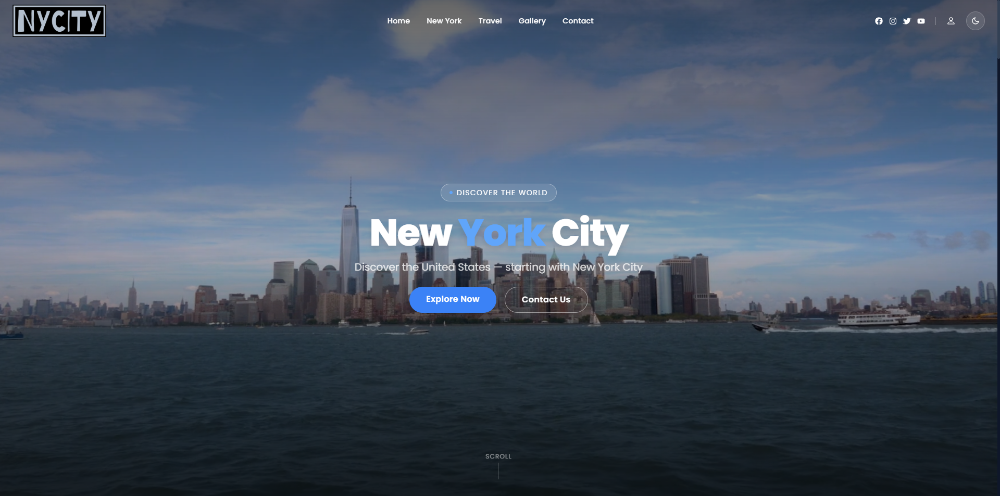
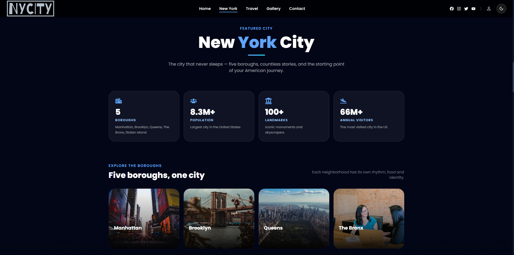
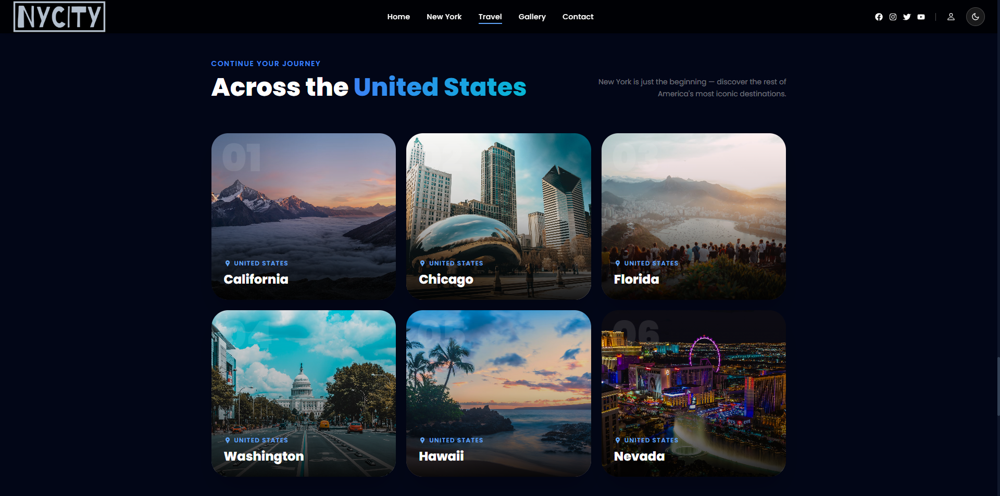
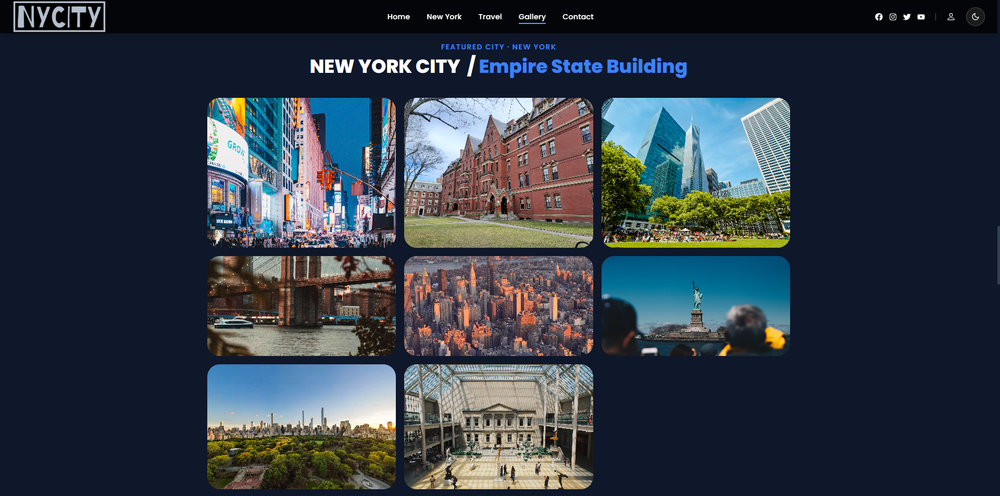
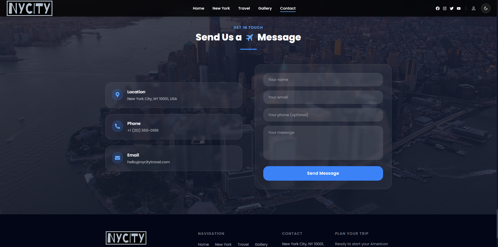

# 🇺🇸 NYC Travel — Discover the United States

> A modern, responsive travel showcase built with React and Tailwind CSS.
> *Discover the United States — starting with New York City.*


---

## ✨ Overview

**NYC Travel** is a frontend showcase that celebrates the United States through cinematic visuals, smooth motion, and a custom design system. The journey starts in New York City — a full-screen video intro, animated entrance, glassmorphism navigation — and continues to iconic destinations across the country.

Built as a portfolio piece to demonstrate clean architecture, accessible UI patterns, and modern visual design.

---

## 📸 Screenshots

| Video hero | New York deep-dive |
| --- | --- |
|  |  |

| Destinations across the US | Photo gallery |
| --- | --- |
|  |  |

| Contact section |
| --- |
|  |

---

## ✨ Features

- 🎥 **Full-screen video hero** with staggered fade-in animation
- 🎠 **Auto-rotating destination carousel** with progress indicator
- 🗽 **New York deep-dive section** — borough cards, landmark stats, and an embedded video
- 🖼️ **Masonry photo gallery** with hover effects and typography
- 🏙️ **Individual city detail pages** with photo lightbox navigation
- 📧 **EmailJS contact form** with validation and status feedback
- 🌗 **Light/dark theme toggle** with saved preference and system-theme detection
- 🎬 **Scroll-triggered reveal animations** via `IntersectionObserver`
- 📱 **Mobile-first responsive design** — works from 320px to 4K
- ⚡ **Smooth scroll navigation** between sections

---

## 🛠️ Tech Stack

| Category | Tools |
| --- | --- |
| **Framework** | React 18, Vite 5 |
| **Styling** | Tailwind CSS 3.4 (custom design system) |
| **Routing** | React Router DOM 6 |
| **Animation** | react-simple-typewriter, custom CSS keyframes |
| **Icons** | react-icons |
| **Forms** | EmailJS |
| **Linting** | ESLint 9 |
| **Deployment** | Netlify (`netlify.toml`) |

---

## 🎨 Design System

A custom Tailwind theme keeps the visual language consistent across every component.

```js
// tailwind.config.js — color tokens
brand:  { 50–950 }   // Primary blue (CTAs, links, highlights)
accent: { 50–900 }   // Cyan (secondary accents, gradient partners)
slate:  { 50–950 }   // Neutrals (text, surfaces, borders)
success / danger / warning   // Semantic states
```

**Typography:** Poppins (300–900), tight letter-spacing for premium feel.

**Radius scale:** `sm` `md` `lg` `xl` `2xl` `3xl` — no ad-hoc values.

**Spacing scale:** `section` (6rem) for consistent vertical rhythm.

---

## 📁 Project Structure

```
src/
├── components/
│   ├── common/
│   │   └── Footer.jsx
│   ├── Hero.jsx              # Full-screen video hero
│   ├── HeroSlider.jsx        # Auto-rotating destination carousel
│   ├── NewYorkFeatured.jsx   # NYC boroughs, stats and video section
│   ├── ImageSlider.jsx       # Masonry photo gallery
│   ├── Selects.jsx           # "Across the United States" destination grid
│   ├── SelectsCard.jsx
│   ├── Contact.jsx           # EmailJS contact form
│   ├── CityDetails.jsx       # Per-city detail page with lightbox
│   ├── Navbar.jsx
│   ├── ThemeToggle.jsx       # Light/dark mode switch
│   ├── Reveal.jsx            # Scroll-reveal wrapper
│   └── Home.jsx
├── context/
│   └── ThemeContext.jsx      # Theme state + localStorage persistence
├── hooks/
│   └── useScrollAnimation.js # useInView / useParallax hooks
├── assets/
│   ├── img/
│   ├── style/
│   └── newyork.mp4
├── cards.js              # Destination data
├── index.css             # Global styles + design tokens
├── App.jsx
└── main.jsx
```

---

## 🚀 Getting Started

### Prerequisites

- Node.js 18+
- npm or yarn

### Installation

```bash
# Clone the repository
git clone https://github.com/Phatma2000/travel-usa.git

# Navigate into the project
cd travel-usa

# Install dependencies
npm install

# Start the dev server
npm run dev
```

Open [http://localhost:5173](http://localhost:5173) to view it in the browser.

### Build for Production

```bash
npm run build
npm run preview
```

---

## 🧠 What I Practiced Building This

- **Component composition** — small, focused components with clear responsibilities
- **Custom design tokens** — building a theme that scales across the app
- **State management** — `useState`/`useEffect` for UI, form, and routing flows
- **Responsive design** — mobile-first breakpoints, fluid typography
- **Performance** — optimized image URLs, code-splitting via Vite
- **Accessibility** — semantic HTML, ARIA labels, keyboard-friendly interactions

---

## 📝 License

MIT © [Phatma Kiazumova](https://github.com/Phatma2000)

---

## 💌 Get in Touch

If you'd like to talk about this project or frontend opportunities:

- GitHub: [@Phatma2000](https://github.com/Phatma2000)
- LinkedIn: [linkedin.com/in/your-profile](#)

---

<p align="center">Designed and built with 💙 in NYC</p>
